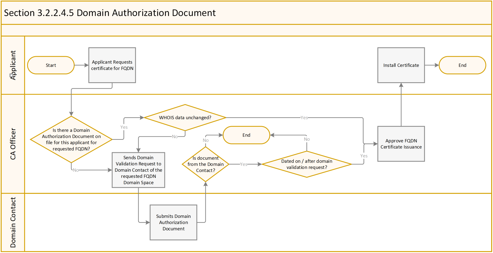
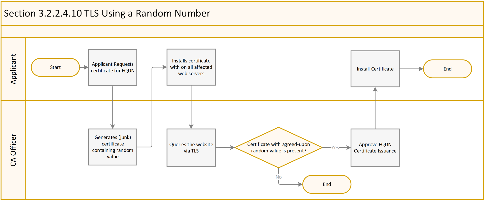

# Domain Authorization For US Federal Government Public Trust

The following is a summary document used during the early policy analysis and review of domain verification methods. This document summarizes the options available for Domain Authorization in 2016 through 2017.

As of September 13, 2017 - Ballot 182 has yet to be integrated back into the CA/B Forum baseline requirements. In addition, please review the IPR Exclusion noticies for the proposed Ballot 182.

- https://cabforum.org/ipr-exclusion-notices/#Ballot-182

The content below is based on CAB Forum Baseline Requirements CP 1.4.5
- https://cabforum.org/wp-content/uploads/CA-Browser-Forum-BR-1.4.5.pdf

## Relevant CAB Forum Baseline Requirements Changes

CAB Forum recently removed options that were previously acceptable. A summary of the options that were permitted prior to these changes can be found below in Appendix 1.

| **Date** | **Section&nbsp;&nbsp;** | **Summary Description** |
|:---------|:---------------- |:----------------------------------------------|
| 2017-01-07 | 3.2.2.4 | Removal of validation methods 1,2,3,4,7,8, and 9. Method 11 added. |
| 2017‐03‐01 |  3.2.2.4 | CAs MUST follow revised validation requirements in section 3.2.2.4 |
| 2017‐04‐22 | 4.2.1 | Re‐use of validation information limited to 825 days |

## Domain Authorization Methods

1. [ Deleted ]
2. [ Deleted ]
3. [ Deleted ]
4. [ Deleted ]

5. **Domain Authorization Document** - Based on the attestation to the authority of the Applicant to request a certificate contained in a Domain Authorization Document
	-	Domain Authorization Document must substantiate that the communication came from the Domain Contact
	-	CA must verify that the Domain Authorization Document was either
		-	Dated on or after the date of the domain validation request or
		-	The WHOIS data has not materially changed since any previously provided Domain Authorization Document for the Domain Name Space

6. **Agreed‐Upon Change to Website** - By confirming one of the following under “/.well-known/pki-validation” directory or other path registered with IANA for the purpose of Domain Validation, on the Authorization Domain Name that is accessible by the CA via HTTP/HTTPS over an Authorized Port
	-	Presence of Required Website Content contained in the content of a file or on a web page in the form of a meta tag.
	-	Presence of the Request Token or Request Value contained in the content of a file on a webpage in the form of a meta tag.
	-	When a Random Value is used:
		-	Random Value must be unique to the certificate request.
		-	Random Value SHALL remain valid for no more than 30 days from its creation
	-	Examples of Request tokens include but are not limited to:
		-	Hash of the public key
		-	Hash of the Subject Public Key Info
		-	Hash of a PKCS#10 CSR
		-	May be concatenated with a timestamp or other data
		-	Challenge password in the creation of a CSR with OpenSSL to ensure uniqueness
7. [ Deleted ]
8. [ Deleted ]
9. [ Deleted ]

10. **TLS Using a Random Number (Embedded in a Certificate)** - By confirming the presence of a Random Value within a Certificate on the Authorization Domain name which is accessible by the CA via TLS over an Authorized Port

11. **Other methods** -

> "The CA SHALL confirm that, as of the date the Certificate issues,
> either the CA or a Delegated Third Party has validated each
> Fully‐Qualified Domain Name (FQDN) listed in the Certificate by using
> any method of confirmation, provided that the CA maintains documented
> evidence that the method of confirmation establishes that the
> Applicant is the Domain Name Registrant or has control over the Fully
> Qualified Domain Name (FQDN)."

## Federal Government Method Selection

### Domain Authorization Document

### Agreed‐Upon Change to Website

### TLS Using a Random Number (Embedded in a Certificate)

### Other Methods
The newly added "Other" option is now on the table, but it's unclear exactly what would continue to be acceptable over time.

## Appendix 1 - Previously Permitted Domain Authorization Methods

The list below summarizes all methods permitted prior to version 1.4.2. The red lined version of the policy showing these changes can be found [here](https://cabforum.org/wp-content/uploads/CA-Browser-Forum-BR-1.4.2-redlined.pdf).

> *The list below are NOT the current requirements.* However, there is ongoing discussion about bringing some or all of these methods back.

1. **Validating the Applicant as a Domain Contact**
	-	Confirm with the Domain Name Registrar that the applicant is the Domain Contact
	-	Generally CA must be the Domain Name Registrar or an Affiliate of the Registrar of the Base Domain Name

2. **Email, Fax, SMS or Postal Mail to Domain Contact**
	-	Send Random value
	-	Receive confirming response utilizing the Random Value
	-	Random Value MUST be sent to an email, fax SMS or postal mail identified for the Domain Contact.
	-	Random Value must be unique in each email, fax, SMS or postal mail.
	-	Random Value SHALL remain valid for no more than 30 days from its creation

3. **Phone Contact with Domain Contact** - By calling the Domain Name Registrar’s phone number

4. **Constructed Email to Domain Contact** - Email to domain contact
	-	Send email to one or more addresses created by using 'admin', 'administrator', 'webmaster', 'hostmaster', or 'postmaster' as the local part, followed by the at-sign ("@"., followed by an Authorization Domain Name
	-	Include a Random Value in the email
	-	Receive a confirming response utilizing the random valu-
	-	Random Value must be unique in each email.
	-	Random Value SHALL remain valid for no more than 30 days from its creation

5. **Domain Authorization Document** - Based on the attestation to the authority of the Applicant to request a certificate contained in a Domain Authorization Document
	-	Domain Authorization Document must substantiate that the communication came from the Domain Contact
	-	CA must verify that the Domain Authorization Document was either
		-	Dated on or after the date of the domain validation request or
		-	The WHOIS data has not materially changed since any previously provided Domain Authorization Document for the Domain Name Space

6. **Agreed‐Upon Change to Website** - By confirming one of the following under “/.well-known/pki-validation” directory or other path registered with IANA for the purpose of Domain Validation, on the Authorization Domain Name that is accessible by the CA via HTTP/HTTPS over an Authorized Port
	-	Presence of Required Website Content contained in the content of a file or on a web page in the form of a meta tag.
	-	Presence of the Request Token or Request Value contained in the content of a file on a webpage in the form of a meta tag.
	-	When a Random Value is used:
		-	Random Value must be unique to the certificate request.
		-	Random Value SHALL remain valid for no more than 30 days from its creation
	-	Examples of Request tokens include but are not limited to:
		-	Hash of the public key
		-	Hash of the Subject Public Key Info
		-	Hash of a PKCS#10 CSR
		-	May be concatenated with a timestamp or other data
		-	Challenge password in the creation of a CSR with OpenSSL to ensure uniqueness

7. **DNS Change** - By confirming the presence of a Random Value or Request Token in a DNS TXT or CAA record for an Authorization Domain Name

8. **IP Address** - By confirming the Applicant controls an IP address returned from a DNS lookup

9. **Test Certificate** - By confirming the Presence of a Non-expired Test Certificate issued by the CA on the Authorization Domain Name
	-	Accessible by the CA via TLS over an Authorized Port for the purpose of issuing a certificate with the same public key as in the Test Certificate

10. **TLS Using a Random Number** - By confirming the presence of a Random Value within a Certificate on the Authorization Domain name which is accessible by the CA via TLS over an Authorized Port
